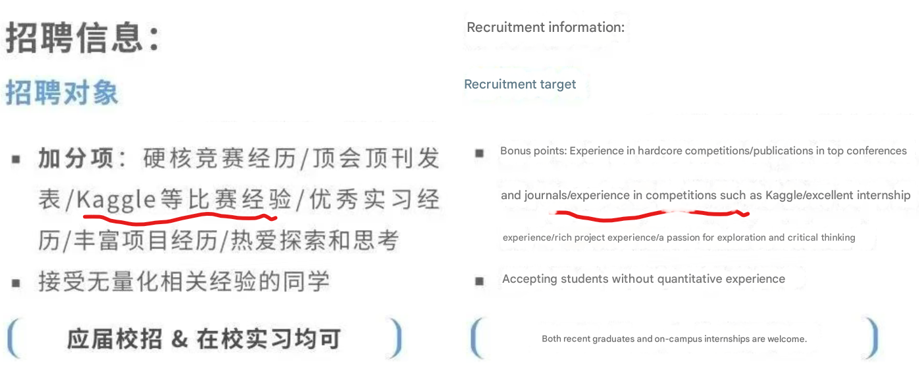

## Final Exam (Hackathon)
### The Artificial Intelligence & Python Programming for Data Scientists (2025 Fall)
Lei Ge 11/24/2025
#### Why `Hackathon`?

Hackathon definition
A **hackathon** is an event set up by a company, research lab, or an organization that wants to get the young talented modelers or data scientists

#### I.  Quant Modeling Project 

1. Quant Modeling
  - you should also address the midterm exam comments from professor, TAs and your validation team
  - Any models such as Linear Regression, Lasso, Random Forest, Xgboost, LightGBM, Catboost, Keras ANN, Pytorch ANN, or model stacking to train you model by using the training sample
  - Model performance table 

2. Feature importance:

- You can choose one of the following feature importance to check your features:

  - Feature importance for Tree based models (Xgboost, LightGBM, Catboost, Random Forest etc)
  - Feature importance table (sklearn.inspection.permutation_importance or other feature importance method)
  - or SHAP value table for your best model (not required but maybe useful)

3. Partial Dependence Plot (PDP) for the key features of your best model (not required but maybe useful)
    - better understand the relationships between key features and target variable
 

4. Algorithms must have 
  - You should have a least one from Ensemble Algorithm or Deep Learning 
    - Ensemble Algorithm: Random Forest, Xgboost, LightGBM, Catboost etc
    - Deep Learning: Keras ANN, Pytorch ANN etc
  - You should tried at least one of the NLP models if possible ( Keywords, LDA, TF-IDF, Word2Vec, Bert, Roberta, Deepseek, Gemma, GPT OSS,  etc)

5. Simple example
- You can check the final exam example notebook here:
https://github.com/Quant-of-Renmin-University/Quant_RUC/blob/main/Exam/Final_Exam_Example.ipynb

#### II. Individual Presentation for Innovations (`Dec 25th or Dec 26th Depending on your session`)

- Presentation is important, it is a simulation of the job interview for the quant researcher or economist position or your future academic works
- You should **highlight** the **innovations** during the hackathon presentation 
- Your score `only depends` on the contents and innovations mentioned by your presentations, but your presentation should be backed by your codes and results (!!!Your results will be checked during the presentation!!!)
- Only talk key points
- max 3 slides (not counts on the frontpage)
- `4 min` presentation and `2~3 questions` to check your works, innovations and other key points 
- penalties for the long presentation: up to 5% off   

1. `In your presentation you need to show the metrics table below`:  

| Metrics| In sample rmse | out of sample rmse| Cross-validation rmse |Kaggle Score |
| --- | --- | --- | --- | --- | 
| Midterm Linear Model | 1234 |1234 | 1234 | 60 |
| Random Forest | 1234 |1234 | 1234 |61 |
| ANN | 1234 |1234 | 1234 |62 |
| Best Model | 1234 |1234 | 1234 |61 |

 

#### IIIa. Hackathon all students first result submission ( one day before presentation date)

  - You need to submit the following files before your presentation date
- Slides: `presentation.pdf` (GitHub: https://github.com/Quant-of-Renmin-University/Quant_RUC/tree/main/Homework)
 

- Scoring: `prediction.csv` (Kaggle: https://www.kaggle.com/competitions/ai-python-exam-for-data-scientists-prof-ge/leaderboard)

 

- Codes: `FinalExam_StudentID_yyyymmdd.ipynb` (datahub: https://datahub.ruc.edu.cn/org/RUC/task/68c1644b7517ac72b2f5a8af/692541267517ac72b2dea0cb/submit)
 

 

#### IIIb. Hackathon final result submission (`submission due Jan ???`)

  - Codes: `FinalExam_StudentID_yyyymmdd.ipynb` (datahub)
  - Scoring: `prediction.csv` (Kaggle)

 

### IV. Scoring

1. Grading Progress
- 1st. line review on the presentation and questions (Lei Ge) 
- 2nd. line review of codes and questions (model validators: Fengxin Li, Chenxi Wang, Tianyou Cui, Hongming Liang, Yubo Ouyang, Jiayi Xue, Wei Liang) aka model validation
- 3rd. line review of codes (model auditor: Lei Ge) aka model auditing

2. key points of the grading:

- The `ML, LLM techniques and strategies` during the presentations
- `Innovations` (**!!! Important !!!**)
- `formality of coding`
- `Bonus: New things to try`:
  - Bert, Roberta, deepseek, Gemma, GPT OSS or other NLP (You can deploy your own LLM on RUC cloud computing platform)
  - pca, autoencoder
  - optuna, hyperopt
  - GNN, CNN, RNN
  - Transfer learning 
  - pretraining
  - ensemble of different types of models 
  - Berttopic or other advanced topic modeling
  - all interesting innovations

   
